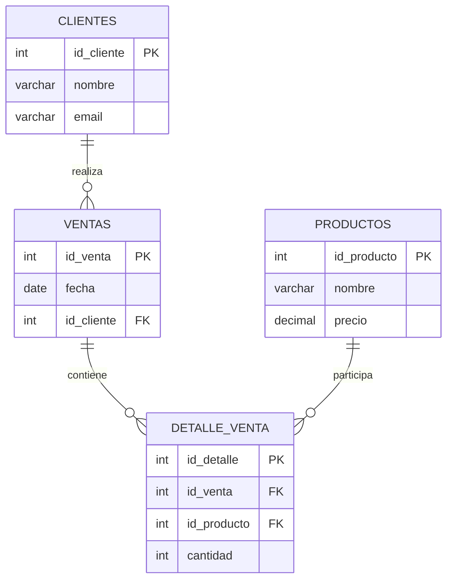

# Sistema de Gestión de Ventas

## Introducción

Este proyecto corresponde al diseño e implementación de una base de datos relacional orientada a la administración de ventas. El objetivo es almacenar de manera organizada la información relacionada con clientes, productos y transacciones comerciales realizadas por una empresa.

A través de este modelo es posible identificar qué clientes realizaron compras, qué productos fueron vendidos y en qué cantidades, permitiendo posteriormente generar consultas y reportes de apoyo para la toma de decisiones.

---

## Objetivos del sistema

La base de datos fue desarrollada para:

* Mantener un registro de clientes.
* Gestionar el catálogo de productos disponibles.
* Registrar ventas efectuadas.
* Asociar productos a cada venta realizada.
* Controlar cantidades vendidas por transacción.
* Obtener información mediante consultas SQL.

---

## Herramientas utilizadas

Para el desarrollo de este proyecto se utilizaron las siguientes tecnologías:

* PostgreSQL como sistema gestor de bases de datos.
* SQL para la creación, manipulación y consulta de los datos.

---

## Organización de archivos

El proyecto está compuesto por los siguientes archivos:

```text
schema.sql
seed.sql
report.sql
README.md
```

### Descripción de cada archivo

| Archivo    | Función                                                      |
| ---------- | ------------------------------------------------------------ |
| schema.sql | Define la estructura de la base de datos y sus relaciones    |
| seed.sql   | Inserta registros de prueba                                  |
| report.sql | Contiene las consultas solicitadas para el análisis de datos |
| README.md  | Documentación general del proyecto                           |

---

## Procedimiento de ejecución

### Paso 1: Crear una base de datos

Ejecutar el siguiente comando desde PostgreSQL:

```sql
CREATE DATABASE sistema_ventas;
```

Posteriormente conectarse a la base de datos creada.

---

### Paso 2: Construir la estructura

Ejecutar el archivo:

```bash
\i schema.sql
```

Este script creará las tablas, claves primarias y claves foráneas necesarias para el funcionamiento del sistema.

---

### Paso 3: Cargar información de ejemplo

Ejecutar:

```bash
\i seed.sql
```

Con este paso se incorporan datos de prueba para realizar consultas y validaciones.

---

### Paso 4: Ejecutar los reportes

Finalmente ejecutar:

```bash
\i report.sql
```

Este archivo contiene consultas de selección, filtros, agrupaciones, ordenamientos y reportes utilizando JOIN, GROUP BY, COUNT, SUM, AVG y HAVING.

---

## Modelo de datos

La solución está compuesta por cuatro entidades principales:

### Clientes

Contiene los datos de identificación y contacto de cada cliente.

### Productos

Almacena la información de los artículos disponibles para la venta.

### Ventas

Registra cada compra realizada dentro del sistema.

### Detalle_Venta

Permite relacionar una venta con uno o varios productos, indicando además la cantidad adquirida de cada uno.

---

## Conclusiones

La implementación de esta base de datos permitió aplicar conceptos fundamentales de modelado relacional, claves primarias y foráneas, relaciones entre tablas y elaboración de consultas SQL para la generación de reportes. Además, sirvió para comprender la importancia de la normalización de datos y del uso de JOIN para relacionar información distribuida en múltiples tablas.


## Diagrama ER


